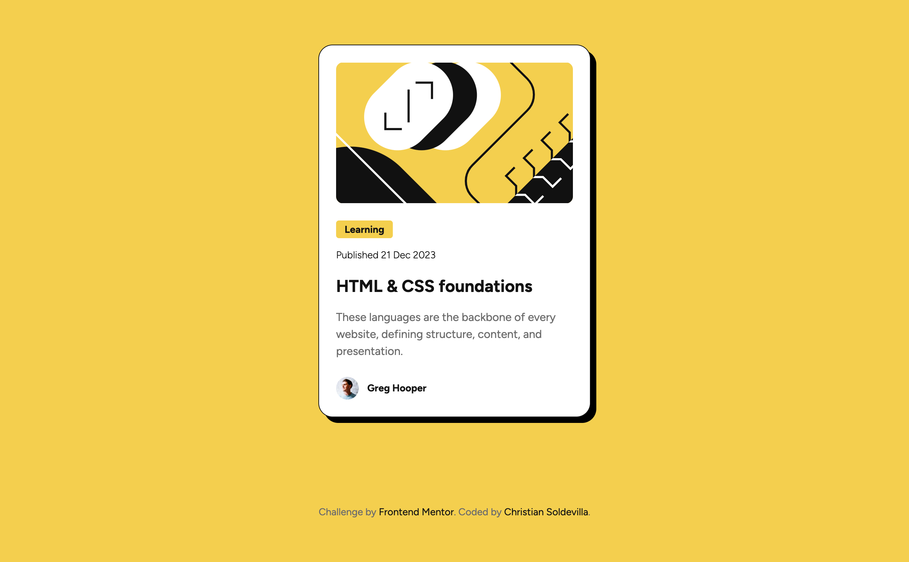
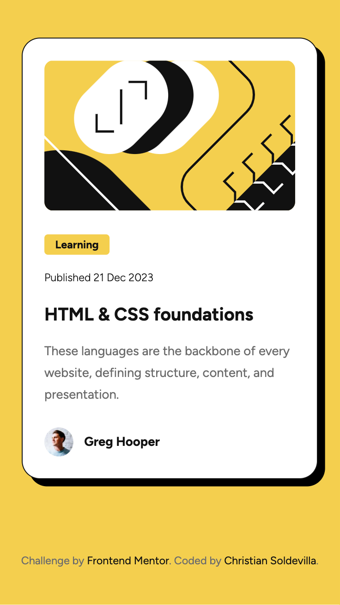

# Frontend Mentor - Blog preview card solution

This is a solution to the [Blog preview card challenge on Frontend Mentor](https://www.frontendmentor.io/challenges/blog-preview-card-ckPaj01IcS). Frontend Mentor challenges help you improve your coding skills by building realistic projects. 

## Table of contents

- [Overview](#overview)
  - [Screenshot](#screenshot)
  - [Links](#links)
- [My process](#my-process)
  - [Built with](#built-with)
  - [What I learned](#what-i-learned)
  - [Useful resources](#useful-resources)
- [Author](#author)

## Overview

This HTML & CSS-only challenge is a perfect project for beginners getting up to speed with HTML and CSS fundamentals, like HTML structure and the box model.

### Screenshot

### Links

- Solution URL: [Add solution URL here](https://github.com/soldochris/blog-preview-card)
- Live Site URL: [Add live site URL here](https://soldochris.github.io/blog-preview-card/)

## My process

### Built with

- Semantic HTML5 markup
- CSS custom properties
- Flexbox
- Mobile-first workflow

### What I learned

I recall how to use flex box for the layout and I feel more confortable working with it.

### Useful resources

- [CSS moderno: Media Queries Range Syntax](https://dev.to/duxtech/media-queries-range-syntax-1o2l) - This helped me to recall the modern way to write media queries using the range syntax. It was very useful because it is clearly written.

## Author

- Website - [christiansoldevilla.tech](https://christiansoldevilla.tech/?i=1)
- Frontend Mentor - [@soldochris](https://www.frontendmentor.io/profile/soldochris)
- LinkedIn - [/christian-soldevilla](https://www.linkedin.com/in/christian-soldevilla/)

